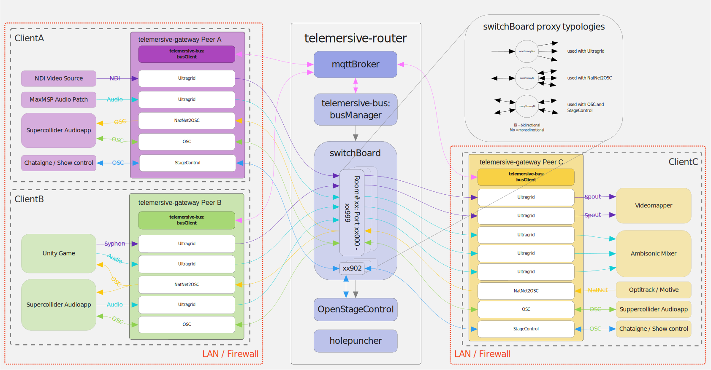

# Telemersive Router



*Telemersive Router* is a collection of services that allow to connect *Telmersive-Gateways* with each other to exchange video, audio and generic data streams.

## Installation

To install an instance of the *Telemersive Router*, clone the github repository into the installation directory (for example `/opt/telemersive-router`).

```
git clone https://github.com/telemersion/telemersive-router
```

Install and configure the required services in this sequence:

1. the [telemersive-switchboard](./switchboard/README.md).
2. the [telemersive-broker](./broker/README.md).
3. the [telemersive-manager](./manager/README.md).
4. the [telemersive-nathelper](./nat-helper/README.md).

## Usage

To manage the services, replace telemersive-XXXX with 

* telemersive-switchboard
* telemersive-broker
* telemersive-manager
* telemersive-nathelper


```bash
# start service
sudo systemctl start telemersive-XXXX.service

# stop service
sudo systemctl stop telemersive-XXXX.service

# restart service
sudo systemctl restart telemersive-XXXX.service

# enable service (auto-start on restart)
sudo systemctl enable telemersive-XXXX.service

# disbale service
sudo systemctl disable telemersive-XXXX.service

# show status
sudo systemctl status telemersive-XXXX.service
```

## Credits

* Roman Haefeli
* Martin Fröhlich
* Florian Bruggisser
* Joel Gähwiler 
